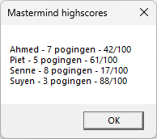

# Mastermind - PE 2

In deze korte uitbreiding gaan we ervoor zorgen dat de gebruiker een aantal zaken kan instellen. We gaan er dus voor zorgen dat een aantal zaken dynamisch worden.

- We gaan een menu toevoegen.
- Bij het starten van het spel gaan we naar de naam van de speler vragen.
- Het aantal maximaal toegelaten pogingen staat nu hardcoded op 10. We gaan ervoor zorgen dat dit dynamisch wordt.
- We gaan highscores bijhouden.

Gebruik de namen die voorzien zijn in de functionele vereisten, maar **zorg ervoor dat je de naming conventions hierop toepast**!

### Functionele vereisten

| ID | Onderwerp | Beschrijving |
| :--- | :--- | :--- |
| Mastermind-PE2-01 | Menu | Voeg een menu toe aan je applicatie: **Bestand** &nbsp;&nbsp;&nbsp;&nbsp;&nbsp;**Nieuw spel** &nbsp;&nbsp;&nbsp;&nbsp;&nbsp;**Highscores** (zie screenshot) &nbsp;&nbsp;&nbsp;&nbsp;&nbsp;**Afsluiten** (sluit de applicatie) **Instellingen &nbsp;&nbsp;&nbsp;&nbsp;&nbsp;Aantal pogingen**    |
| Mastermind-PE2-02 | Nieuw spel | Bij het starten van het spel gaan we naar de naam van de speler vragen. Zorg ervoor dat deze niet leeg kan zijn. Gebruik de methode *startgame* hiervoor die een string teruggeeft die de naam van de speler bevat. *Tip: gebruik een dialoogvenster en blijf invoer vragen tot een naam is ingegeven* |
| Mastermind-PE2-03 | Speleinde | In ***Mastermind-09 (Speleinde)*** heb je na het speleinde de vraag gesteld om men nog eens wil spelen. Deze vraag mag niet meer gesteld worden, de applicatie kan **enkel** gesloten worden met het kruisje of via het menu (zie Mastermind-PE2-01). |
| Mastermind-PE2-04 | Highscores | Zorg dat je bij elk speleinde de score bijhoudt in een overzicht van highscores. Maak hiervoor een string array *highscores*. Je mag ervan uitgaan dat er maximaal 15 scores moeten worden bijgehouden. Zoals in de screenshot hierboven te zien is, registreer je een highscore in de vorm van **[naam speler] - [x pogingen] - [score/100]** |
| Mastermind-PE2-05 | Aantal pogingen | Het aantal maximaal toegelaten pogingen staat nu hardcoded op 10. We gaan ervoor zorgen dat dit dynamisch wordt door dit te laten ingeven door de gebruiker. Zorg ervoor dat dit tussen 3 en 20 ligt en dat er enkel getallen kunnen worden ingegeven. Pas je applicatie aan dat het spel pas eindigt na dit maximaal aantal pogingen. |
