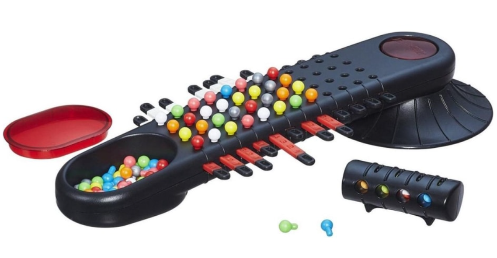

# Basis versie Mastermind

## Concept(en)

Het project is gebaseerd op het spel Mastermind, waarbij het doel is om
zo snel mogelijk de kleurcode te kraken.

**Spelverloop:**

In het begin van het spel wordt er automatisch een code gegenereerd.
Deze code bestaat uit 4 willekeurig gekozen kleuren uit een
kleurenpallet (rood, geel, oranje, wit, groen en blauw). Het doel is dat
de speler deze code raadt en het maximale aantal van 10 punten scoort.
Een onvolledige code levert ook punten op. Dit wordt berekend op basis
van een status per kleur:

-   Wit (1 punt): de kleur komt voor in de code, maar staat niet op de
    juiste plaats

-   Rood (2 punten): de kleur op deze positie is correct

## Technische analyse

### Technische vereisten

-   C# om de logica van de applicatie te creëren.

-   XAML om de UI te bouwen.

-   Visual Studio als programmeeromgeving.

## Functionele analyse

### Ontwerp -- User interface

Een POC (Proof Of Concept) zie je in Figuur 1 Startscherm. Je wordt
echter aangemoedigd om een eigen ontwerp te bouwen voor je Mastermind
*(maak geen kopie van het voorbeeld!).*

Figuur 1 Startscherm

Figuur 2 Kleur kiezen

Figuur 3 Border Wheat

Figuur 4 Border DarkRed

### Functionele vereisten

| ID | Onderwerp | Beschrijving |
| :--- | :--- | :--- |
| Mastermind-01 | Opstarten | De applicatie start in een begintoestand waarbij er 4 comboboxen worden getoond die leeg zijn en een button om de ingegeven code te valideren. |
| MasterMind-02 | Code | Er wordt een random code van 4 kleuren gegenereerd. Om het spel makkelijker te testen wordt deze code in de titel van het window getoond. De 4 kleuren worden willekeurig gekozen uit een reeks van 6 beschikbare kleuren: rood, geel, oranje, wit, groen en blauw.
| MasterMind-03 | ComboBoxen | De 4 comboboxen worden gevuld met de 6 beschikbare kleuren. |
| MasterMind-04 | Kleur kiezen | Wanneer er een kleur gekozen wordt uit een combobox wordt deze getoond in een label. (zie Figuur 2 Kleur kiezen)                |
| MasterMind-05 | Code controleren | Wanneer er op de knop geklikt wordt, wordt de ingegeven code gecontroleerd. Wanneer de kleur voorkomt in de code, maar niet op de juiste plaats staat, wordt een witte rand (Colors.Wheat) rond de kleur getoond. (zie Figuur 3 Border Wheat) Wanneer de kleur op de juiste plaats staat, wordt er een rode rand (Colors.DarkRed) getoond. (zie Figuur 4 Border DarkRed) |

## Aanpak en tips

### Stappenplan

-   Analyseer grondig wat er geprogrammeerd moet worden en hoe je dat
    gaat doen.
-   Probeer te achterhalen wat het moeilijkste deel van de oefening is
    (vb. hoe genereer je een random code van 4 kleuren?) en onderzoek
    hoe je dit kan oplossen.
-   Programmeer het spel in Visual Studio.
-   Test het spel om te zien of het in alle omstandigheden werkt.
-   Zorg ervoor dat je code mooi gestructureerd is (vb. gebruik zinvolle
    namen voor variabelen).

### Programmeertips

-   Maak een method aan die een random code van 4 kleuren genereert.
-   Maak een method aan die je ingegeven kleurcode controleert.
-   Gebruik private class-variabele om de code te bewaren.
-   Gebruik BorderBrush en BorderThickness om een rand te tonen rond een
    label.